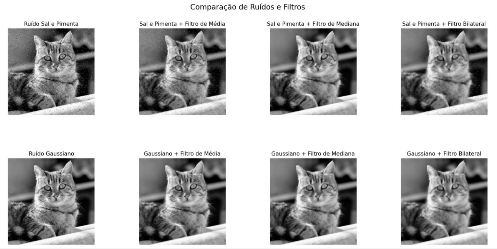
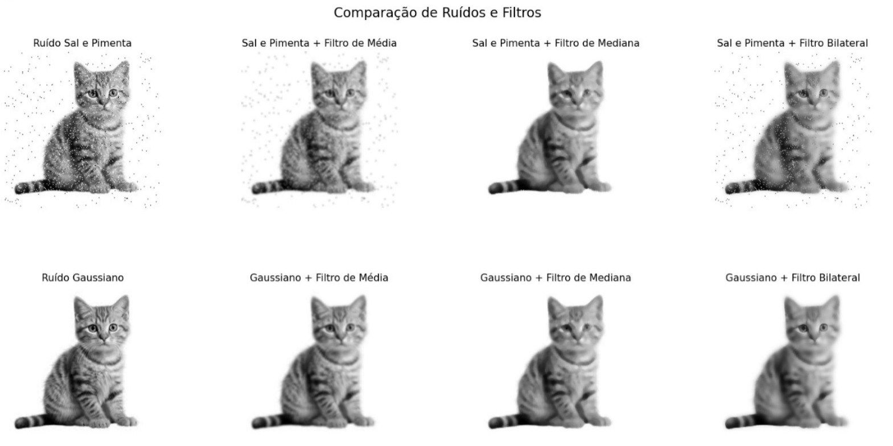

# Ruídos e Filtros

**Objetivo**: avaliar a eficácia de diferentes filtros de suavização no tratamento de ruídos aplicados a uma imagem

**Instruções**:

1. Carregue uma imagem em escala de cinza.
2. Aplique dois tipos de ruídos à imagem: **Ruído Gaussiano e Ruído Sal e Pimenta**
3. Aplique os seguintes filtros à imagem ruidosa: ***filtro da média (gaussiano), filtro da mediana, filtro bilateral***
4. Para cada tipo de ruído, visualize e compare os resultados de cada filtro.
5. **Desafio**: Explique qual filtro se mostrou mais eficaz para cada tipo de ruído e por que.

Segue as Imagens utilizadas:

Neste projeto fiz um módulo chamado "ruidos_e_filtros.py" e também um "main.py", onde "ruidos_e_filtros" estão as funções de ruídos "sal e pimenta" e "gaussiano" e também filtros "média", "mediana" e "bilateral". O Módulo main.py está a parte de exibição utilizando a biblioteca matplotlib, as imagens são exibidas em GrayScale ou seja em preto e branco e plotadas em grade. Segue os exemplos utilizando a imagem de um gato:

Neste exemplo podemos perceber como houve até uma melhora na imagem com ruido "gaussiano", mas o ruido de "sal e pimenta", está pouco visivel, então vejamos outro exemplo:

Aqui podemos ver as mudanças no ruído de "sal e pimenta".

E comparação com os dois ruidos e aplicação dos filtros:

No ruido "sal e pimenta" o filtro de "mediana" se mostrou mais eficaz em remover os ruídos da imagem.

ja o ruido "gaussiano" apesar da "média" ter sido eficaz, "suavizou" demais a imagem, por esse motivo o filtro
de "bilateral" foi mais eficaz nesse ruído.

# Ruidos_Filtros
